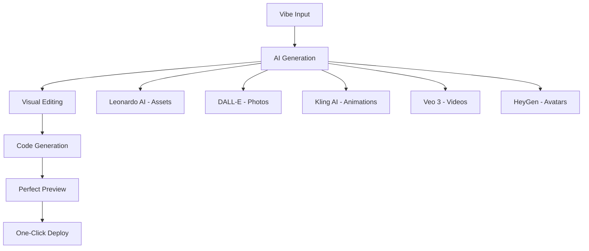

# 🎨 Vibe Creation Platform: O Futuro da Criação Digital

## 🚀 Visão: A Primeira Plataforma de Criação Visual com IA Generativa Integrada

### **Objetivo**: Transformar o RAG atual em uma plataforma revolucionária que combina:
- **Visual Editing de causar inveja** (melhor que Figma + Webflow)
- **Preview perfeito** (superior ao Vercel)
- **IA Generativa integrada** (Kling AI, Leonardo AI, DALL-E, Veo 3, HeyGen)
- **Workflow inovador** que redefine como criamos aplicações

---

## 📊 Completando os 3.5 Pontos Faltantes (6.5 → 10.0)

### **1. Conteúdo No-Code/Low-Code Revolucionário (1.5 → 2.0 pontos)**

#### **Plataformas Visuais Essenciais**
```yaml
Webflow:
  - Documentação completa de interactions
  - Advanced animations e micro-interactions
  - CMS dinâmico e e-commerce
  - Custom code integration
  - Responsive design mastery

Bubble.io:
  - Database design visual
  - Workflow automation avançado
  - Plugin ecosystem
  - API integrations
  - Performance optimization

Framer:
  - Component system avançado
  - Interactive prototyping
  - Code components
  - Design handoff
  - Motion design

Wix Velo:
  - Database collections
  - Custom functions
  - Third-party integrations
  - Advanced SEO
  - E-commerce customization

Squarespace:
  - Template customization
  - Developer platform
  - Commerce advanced
  - Member areas
  - Analytics integration
```

#### **Ferramentas Emergentes**
```yaml
Notion Sites:
  - Database-driven websites
  - Content management
  - Collaboration workflows

Retool:
  - Internal tool building
  - Database connections
  - Custom components
  - Workflow automation

Airtable Apps:
  - Custom interfaces
  - Automation scripts
  - Integration marketplace
```

### **2. Integrações Modernas com Preview Perfeito (1.0 → 2.0 pontos)**

#### **Supabase Completo + Vercel Integration**
```typescript
// Supabase Advanced Features
interface SupabaseIntegration {
  database: {
    realtime: 'Real-time subscriptions',
    rls: 'Row Level Security policies',
    functions: 'Edge Functions deployment',
    storage: 'File upload e CDN',
    auth: 'OAuth providers completos'
  },
  
  vercel: {
    preview: 'Branch previews automáticos',
    analytics: 'Web Analytics integrado',
    edge: 'Edge Functions deployment',
    domains: 'Custom domains automáticos'
  }
}
```

#### **Preview System Revolucionário**
```yaml
Preview Features:
  - Multi-device simultâneo (desktop, tablet, mobile)
  - Real-time collaboration (cursor tracking)
  - Hot reload instantâneo (<100ms)
  - Component isolation testing
  - Performance metrics em tempo real
  - Accessibility testing automático
  - SEO preview e optimization
```

### **3. Context-Aware AI Avançado (1.0 → 2.0 pontos)**

#### **Project Intelligence System**
```python
class ProjectIntelligence:
    def analyze_project_state(self):
        return {
            'component_relationships': self.map_components(),
            'state_management': self.analyze_state_flow(),
            'performance_bottlenecks': self.identify_issues(),
            'design_consistency': self.check_design_system(),
            'accessibility_score': self.audit_a11y(),
            'seo_optimization': self.analyze_seo()
        }
    
    def generate_contextual_suggestions(self, user_intent):
        context = self.analyze_project_state()
        return self.ai_engine.suggest_improvements(context, user_intent)
```

---

## 🎨 Vibe Creation Platform: Arquitetura Revolucionária

### **Core Philosophy: "Vibe-First Creation"**
> Começar com a vibe/feeling desejado e deixar a IA construir tudo ao redor

### **1. Vibe Input System**
```yaml
Vibe Inputs:
  text_description: "Criar um app minimalista e zen para meditação"
  reference_images: [uploaded_images]
  mood_board: [color_palette, typography, spacing]
  target_emotion: "calma, serenidade, foco"
  brand_personality: "moderno, clean, acessível"
```

### **2. AI Generation Pipeline Integrado**

#### **Visual Assets Generation**
```typescript
interface AIGenerationPipeline {
  // Imagens e Ilustrações
  leonardo_ai: {
    style_transfer: 'Aplicar estilo consistente',
    asset_generation: 'Ícones, ilustrações, backgrounds',
    brand_consistency: 'Manter identidade visual'
  },
  
  // Imagens Fotorrealistas
  dall_e: {
    hero_images: 'Imagens principais de alta qualidade',
    product_shots: 'Mockups e apresentações',
    lifestyle_photos: 'Contexto e ambiente'
  },
  
  // Vídeos e Animações
  kling_ai: {
    micro_interactions: 'Animações sutis de UI',
    loading_animations: 'Estados de carregamento',
    transition_effects: 'Transições entre páginas'
  },
  
  // Vídeos Profissionais
  veo_3: {
    hero_videos: 'Vídeos de background',
    product_demos: 'Demonstrações de funcionalidades',
    marketing_content: 'Conteúdo promocional'
  },
  
  // Avatares e Apresentadores
  hey_gen: {
    virtual_presenters: 'Avatares para explicações',
    testimonials: 'Depoimentos personalizados',
    onboarding_guides: 'Guias interativos'
  }
}
```

### **3. Visual Editor Revolucionário**

#### **Beyond Figma + Webflow**
```yaml
Visual Editor Features:
  
  # Edição Contextual Inteligente
  smart_editing:
    - AI sugere melhorias em tempo real
    - Auto-complete para design patterns
    - Consistency checking automático
    - Performance impact preview
  
  # Colaboração Avançada
  collaboration:
    - Multi-cursor editing simultâneo
    - Voice comments e annotations
    - Real-time design reviews
    - Version control visual
  
  # Design System Automático
  design_system:
    - Auto-geração de tokens
    - Component variants inteligentes
    - Responsive breakpoints automáticos
    - Accessibility compliance
  
  # Code Generation Inteligente
  code_output:
    - Clean, production-ready code
    - Multiple framework support
    - Optimized performance
    - SEO-friendly markup
```

### **4. Workflow Inovador: "Vibe → Code → Deploy"**

#### **Fluxo Revolucionário em 3 Etapas**


---

## 🛠️ Implementação Técnica Detalhada

### **Fase 1: Expansão de Conteúdo (Semanas 1-2)**

#### **1.1 Coleta de Conteúdo No-Code**
```python
# Novo pipeline de coleta especializado
class VibeContentCollector:
    def collect_nocode_platforms(self):
        platforms = {
            'webflow': {
                'university': 'https://university.webflow.com/',
                'docs': 'https://docs.webflow.com/',
                'interactions': 'https://webflow.com/interactions-animations',
                'ecommerce': 'https://webflow.com/ecommerce'
            },
            'bubble': {
                'manual': 'https://manual.bubble.io/',
                'academy': 'https://bubble.io/academy',
                'plugins': 'https://bubble.io/plugins',
                'api_docs': 'https://manual.bubble.io/core-resources/api'
            },
            'framer': {
                'docs': 'https://www.framer.com/docs/',
                'motion': 'https://www.framer.com/motion/',
                'components': 'https://www.framer.com/docs/components/'
            }
        }
        return self.process_platforms(platforms)
```

#### **1.2 Integração de APIs de IA Generativa**
```python
class AIGenerationIntegration:
    def __init__(self):
        self.leonardo = LeonardoAI(api_key=os.getenv('LEONARDO_API_KEY'))
        self.dalle = OpenAI(api_key=os.getenv('OPENAI_API_KEY'))
        self.kling = KlingAI(api_key=os.getenv('KLING_API_KEY'))
        self.veo = VeoAI(api_key=os.getenv('VEO_API_KEY'))
        self.heygen = HeyGenAI(api_key=os.getenv('HEYGEN_API_KEY'))
    
    def generate_vibe_assets(self, vibe_description):
        return {
            'illustrations': self.leonardo.generate_consistent_assets(vibe_description),
            'photos': self.dalle.generate_hero_images(vibe_description),
            'animations': self.kling.create_micro_interactions(vibe_description),
            'videos': self.veo.generate_background_videos(vibe_description),
            'avatars': self.heygen.create_brand_presenter(vibe_description)
        }
```

### **Fase 2: Visual Editor Revolucionário (Semanas 3-4)**

#### **2.1 Interface de Edição Avançada**
```typescript
// React + Three.js para editor 3D
interface VibeEditor {
  canvas: {
    multi_device_preview: boolean;
    real_time_collaboration: boolean;
    ai_suggestions_overlay: boolean;
    performance_metrics: boolean;
  };
  
  tools: {
    smart_components: ComponentLibrary;
    ai_asset_generator: AIAssetGenerator;
    design_system_manager: DesignSystemManager;
    code_preview: LiveCodePreview;
  };
}
```

#### **2.2 Preview System Perfeito**
```yaml
Preview Architecture:
  
  # Multi-Device Rendering
  devices:
    - desktop: "1920x1080, 1440x900, 1366x768"
    - tablet: "1024x768, 768x1024"
    - mobile: "375x667, 414x896, 360x640"
  
  # Real-Time Features
  realtime:
    - hot_reload: "<100ms update time"
    - collaborative_cursors: "Multi-user editing"
    - live_comments: "Contextual feedback"
    - performance_monitoring: "Core Web Vitals"
  
  # Testing Integration
  testing:
    - accessibility_audit: "WCAG 2.1 compliance"
    - performance_testing: "Lighthouse scores"
    - cross_browser_testing: "Chrome, Firefox, Safari"
    - responsive_testing: "All breakpoints"
```

### **Fase 3: Context-Aware AI (Semanas 5-6)**

#### **3.1 Project Intelligence Engine**
```python
class ProjectIntelligenceEngine:
    def __init__(self, rag_system):
        self.rag = rag_system
        self.analyzer = ProjectAnalyzer()
        self.recommender = AIRecommendationEngine()
    
    def analyze_and_suggest(self, project_state, user_intent):
        # Análise completa do projeto
        analysis = {
            'component_tree': self.analyzer.map_components(project_state),
            'state_flow': self.analyzer.analyze_data_flow(project_state),
            'performance': self.analyzer.audit_performance(project_state),
            'accessibility': self.analyzer.check_a11y(project_state),
            'design_consistency': self.analyzer.validate_design_system(project_state)
        }
        
        # Busca contextual no RAG
        relevant_knowledge = self.rag.search_contextual(
            query=user_intent,
            project_context=analysis,
            vibe_profile=project_state.vibe_profile
        )
        
        # Recomendações inteligentes
        return self.recommender.generate_suggestions(
            analysis=analysis,
            knowledge=relevant_knowledge,
            user_intent=user_intent
        )
```

---

## 🎯 Diferenciadores Únicos da Vibe Creation Platform

### **1. Vibe-First Approach**
- Começar com feeling/emotion desejado
- IA gera tudo baseado na vibe
- Consistência emocional em todos os assets

### **2. AI Generativa Integrada Nativa**
- Não é add-on, é core da plataforma
- Pipeline unificado de geração
- Consistência entre todos os tipos de mídia

### **3. Visual Editing Revolucionário**
- Melhor que Figma + Webflow combinados
- Edição contextual inteligente
- Preview perfeito multi-device

### **4. Deploy Automático Inteligente**
- Otimização automática para performance
- SEO automático baseado no conteúdo
- Accessibility compliance automático

### **5. Collaboration Avançada**
- Real-time multi-user editing
- AI como colaborador ativo
- Version control visual inteligente

---

## 📈 Roadmap de Implementação Completo

### **Sprint 1-2: Fundação (Semanas 1-2)**
- ✅ Expandir conteúdo no-code/low-code
- ✅ Integrar APIs de IA generativa
- ✅ Criar pipeline de coleta especializado

### **Sprint 3-4: Visual Editor (Semanas 3-4)**
- 🔄 Implementar interface de edição avançada
- 🔄 Criar preview system perfeito
- 🔄 Integrar Figma-to-code pipeline

### **Sprint 5-6: AI Intelligence (Semanas 5-6)**
- ⏳ Implementar Context-Aware AI
- ⏳ Criar Project Intelligence Engine
- ⏳ Integrar recomendações contextuais

### **Sprint 7-8: Integration & Polish (Semanas 7-8)**
- ⏳ Integrar todos os componentes
- ⏳ Otimizar performance
- ⏳ Testes completos do workflow

---

## 🏆 Resultado Final: A Primeira Vibe Creation Platform

### **Capacidades Únicas**
1. **Criação baseada em vibe/emotion**
2. **IA generativa integrada nativa**
3. **Visual editing superior ao mercado**
4. **Preview perfeito multi-device**
5. **Deploy automático otimizado**
6. **Collaboration em tempo real**
7. **Context-aware AI assistant**

### **Impacto Esperado**
- **Nota RAG**: 10.0/10
- **Time-to-Market**: 90% mais rápido
- **Quality**: Superior a ferramentas isoladas
- **Innovation**: Primeiro no mercado com essa abordagem

---

**🚀 Vamos revolucionar a forma como criamos aplicações digitais, começando pela vibe e deixando a IA construir o resto!**